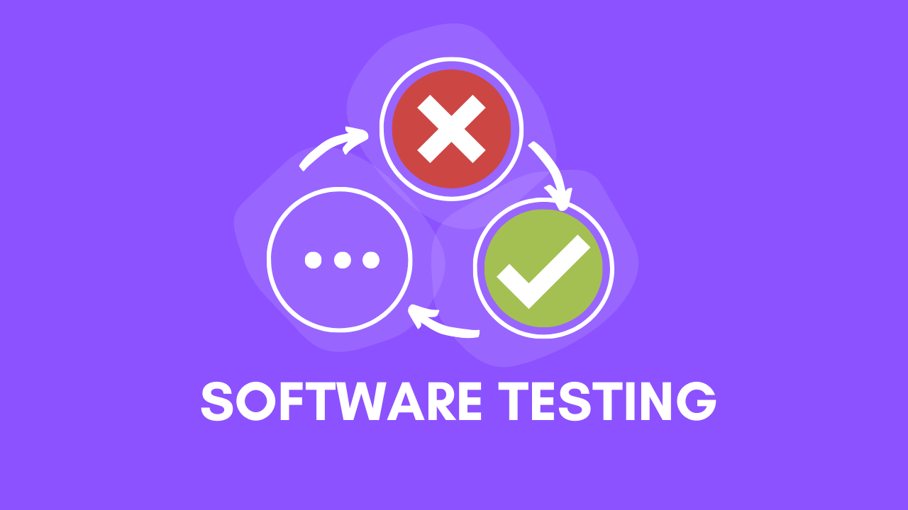
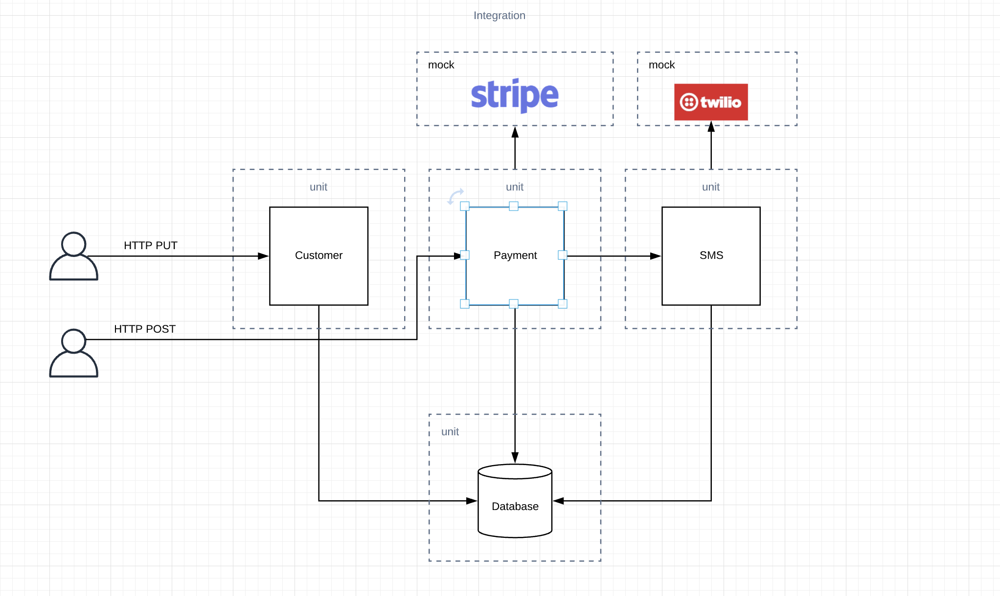

# Spring Boot Test

- This project was created through the `Software Testing` course, to access it click [here](https://amigoscode.com/courses/software-testing).
- This repository has some changes and improvements to what is presented in the course.



## Index :pushpin:
- [About](#about) 
- [Architecture Diagram](#architecture)
- [Coverage Examples](#coverage)
- [Show me the code](#code)

## About <a name="about"></a> :bulb:

Software Testing is a skill that you must fully grasp as a software engineer. It ensures that any code you write to production is more likely to contain less bugs.

In this repository you will see everything about some types of tests implemented that were presented in the [course](https://amigoscode.com/courses/software-testing):
- Unit Testing
- Integration Testing
- Testing External Services
- Mocking with Mockito
- Test Driven Development -`TDD`

## Architecture Diagram <a name="architecture"></a> :pencil2:

- This diagram shows how the system and its layers were separated to understand each part of the tests.


## Coverage Examples <a name="coverage"></a> :white_check_mark:

#### SonarQube


#### IntelliJ IDEA


## Show me the code <a name="code"></a> :computer:

- Testing the _CustomerRepository_ class using the settings with `@DataJpaTest`.

```java
@Test
void itShouldSelectCustomerByPhoneNumberExists() {
    // Given
    UUID id = UUID.randomUUID();
    String phoneNumber = "0000";
    Customer customer = new Customer(id, "Murillo", phoneNumber);

    // When
    underTest.save(customer);
    Optional<Customer> optionalCustomer = underTest.selectCustomerByPhoneNumber(phoneNumber);

    // Then
    assertThat(optionalCustomer)
            .isPresent()
            .hasValueSatisfying(c -> {
                assertThat(c).isEqualToComparingFieldByField(customer);
            });
}
```

- Testing the _CustomerRegistrationService_ class using `@Mock` and `@Captor`.

```java
@Test
void itShouldSaveNewCustomer() {
    // Given a phone number and a customer
    String phoneNumber = "000099";
    Customer customer = new Customer(UUID.randomUUID(), "Murillo", phoneNumber);

    // ... a request
    CustomerRegistrationRequest request = new CustomerRegistrationRequest(customer);

    // ... No customer with phone number passed
    // -> when this code is called in the service, we force the return of this method to be "empty",
    // so that it falls into the condition of saving the object and does not fall into the logic of the IF
    // otherwise it will not go to DB, so we are mocking the data
    given(customerRepository.selectCustomerByPhoneNumber(phoneNumber))
            .willReturn(Optional.empty());

    // ... Valid phone number
    given(phoneNumberValidator.validate(phoneNumber)).willReturn(Boolean.TRUE);

    // When
    underTest.registerNewCustomer(request);

    // Then
    then(customerRepository).should().save(customerArgumentCaptor.capture()); // capture the same value passed in call method 'request'
    Customer customerArgumentCaptorValue = customerArgumentCaptor.getValue(); // get Customer used in request (custumer)
    assertThat(customerArgumentCaptorValue).isEqualTo(customer); // compare Customer with Customer passed in request (are the same object)
}
```

- Testing the _PaymentIntegrationTest_ class using `@SpringBootTest` and `@AutoConfigureMockMvc` to perform integration testing, making HTTP calls to Controllers.

```java
//it starts the application instead of testing separately
//To test endpoints, it is necessary to use this annotation, as it will go up the spring service to perform this test.
@SpringBootTest
@AutoConfigureMockMvc //Without this "auto configuration" it will not work
class PaymentIntegrationTest {

    @Autowired
    private PaymentRepository paymentRepository;

    @Autowired
    private MockMvc mockMvc;

    @Test
    void itShouldCreatePaymentSuccessfully() throws Exception {
        // Given a customer
        UUID customerId = UUID.randomUUID();
        Customer customer = new Customer(customerId, "Murillo", "+447000000000");

        CustomerRegistrationRequest customerRegistrationRequest = new CustomerRegistrationRequest(customer);

        // Customer Register
        ResultActions customerRegResultActions = mockMvc.perform(put("/api/v1/customer-registration")
                .contentType(MediaType.APPLICATION_JSON)
                .content(Objects.requireNonNull(objectToJson(customerRegistrationRequest))));

        // ... Payment
        long paymentId = 1L;
        Payment payment = new Payment(
                paymentId,
                customerId,
                new BigDecimal("10.00"),
                Currency.BRL,
                "x0x0x0x0",
                "Zakat"
        );

        // ... Payment request
        PaymentRequest paymentRequest = new PaymentRequest(payment);

        // ... When payment is sent
        ResultActions paymentResultActions = mockMvc.perform(post("/api/v1/payment")
                .contentType(MediaType.APPLICATION_JSON)
                .content(Objects.requireNonNull(objectToJson(paymentRequest))));

        // Then both customer registration and payment requests are 200 status code
        customerRegResultActions.andExpect(status().isOk());
        paymentResultActions.andExpect(status().isOk());

        // Payment is stored in db
        // TODO: Do not use paymentRepository instead create an endpoint to retrieve payments for customers
        assertThat(paymentRepository.findById(paymentId))
                .isPresent()
                .hasValueSatisfying(p -> assertThat(p).isEqualToComparingFieldByField(payment));
    }
}
```
